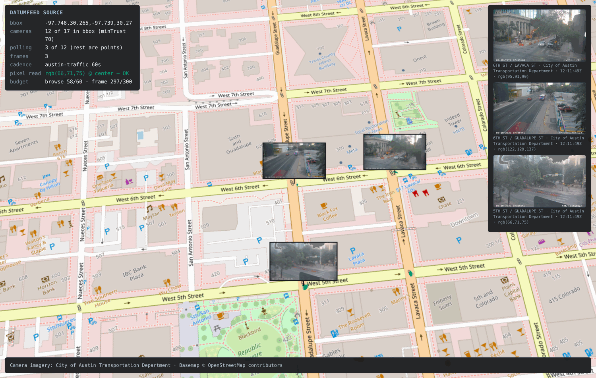

# Datumfeed source

A data source for public traffic-camera feeds: fetch cameras by viewport, pull
their current frames, put them on the map.

[Datumfeed](https://datumfeed.com) is a free API that catalogues public camera
registries, health-polls them, and scores each camera for trust. As of August
2026 it lists **8,507 active cameras across 6 registries** — Austin, Caltrans,
Ontario 511, Ottawa, TfL (London) and WSDOT. No key is needed to try it.



## Files

| File | What it is |
| --- | --- |
| `datumfeed-source.js` | The client. Zero imports, no DOM assumptions — usable from any renderer. |
| `deckgl-layers.js` | deck.gl binding: an upright `IconLayer` card per live frame + a `ScatterplotLayer` of camera positions. |
| `demo/index.html` | Standalone demo, no build step. Open it and it runs. |

## Quick start

```js
import { DatumfeedSource, FramePoller } from './sources/datumfeed/datumfeed-source.js';
import { createDatumfeedLayers, attributionText } from './sources/datumfeed/deckgl-layers.js';

// A few blocks of downtown Austin — see "Budget" below before you widen this.
const BBOX = [-97.7480, 30.2650, -97.7390, 30.2700];
const CENTER = [-97.7443, 30.2674];

const source = new DatumfeedSource({ minTrust: 70 });
const { cameras, total } = await source.camerasInBbox(BBOX, { max: 50 });

const poller = new FramePoller(source, {
  maxFrames: 6,                     // how many get live imagery; the rest are points
  onFrame: () => deck.setProps({ layers: build() })
});

const build = () => createDatumfeedLayers({
  cameras,                          // all of them, as points
  frames: poller.frames,            // only the polled ones have imagery
  options: { widthPx: 150 }         // upright cards; see "Configuration"
});

poller.setCameras(cameras, { center: CENTER });
deck.setProps({ layers: build() });

// Required — see below.
creditsEl.textContent = attributionText(poller.attributions);
```

Peer dependency: `@deck.gl/layers`, for `deckgl-layers.js` only. The client
itself has none.

## Three obligations

The API asks consumers for three things, and all three are handled in code
rather than left as documentation:

1. **Show `registry.attribution` beside any frame you render.**
   `attributionsFor()` returns the distinct credit strings for a camera set, and
   `FramePoller` keeps `.attributions` current as the viewport changes.
2. **Do not poll a camera faster than its registry's `minPollIntervalS`.**
   `FramePoller` reads the cadence per registry and schedules from it, and
   stretches to a longer `Cache-Control: max-age` when a frame response asks
   for one. Polling faster gains nothing anyway — frames are cached server-side,
   so a faster loop just re-fetches identical bytes.
3. **Stay inside the rate limit.** See below; this is the one that bites.

## Budget

Read this before you point it at a city.

Anonymously the API allows **60 requests/hour for browsing and 300/hour for
frames**, per IP. Those are separate budgets. A free key raises them to **3,600
and 36,000**.

Frames are the constraint, and the arithmetic is unforgiving: one camera at a
60 s cadence is 60 requests an hour.

| | anonymous (300/h) | free key (36,000/h) |
| --- | --- | --- |
| cameras kept live at 60 s | ~5 | ~600 |
| cameras kept live at 180 s (TfL) | ~15 | ~1,800 |

Whole-city Austin is 583 cameras above `minTrust: 70`. Live imagery for all of
them is ~35,000 requests/hour: fine with a key, 116x over the anonymous budget.
So: **anonymous is right for a viewport of a few blocks, or for browsing the
catalogue and rendering positions. [Get a free key](https://datumfeed.com) before
you widen the box.**

Two mechanisms keep that from turning into a wall of 429s:

- **`FramePoller`'s `maxFrames`** (default 24) polls only the cameras nearest
  the view centre. Everything else in the viewport still renders as a point,
  which costs nothing — you get the full map, with imagery where the user is
  looking.
- **A token bucket in the client**, one per budget, paced from the published
  limit and then corrected by every response's `X-RateLimit-Remaining` /
  `X-RateLimit-Reset`. A concurrency cap is not a rate cap; this is the rate
  cap. Overshoot degrades into slower refreshes rather than errors, and a 429's
  `Retry-After` holds the whole bucket, not just the request that earned it.
  Waits are jittered, so a window reset does not wake every camera at once.

`onRateLimit` reports both budgets as they drain if you want to surface them:

```js
new DatumfeedSource({
  onRateLimit: ({ scope, remaining, limit, delayS }) => {
    // scope is 'browse' or 'frame'; delayS is how long the next request waits
  }
});
```

## Configuration

```js
new DatumfeedSource({
  apiKey: undefined,          // optional; unlocks the higher rate tier
  minTrust: 70,               // 0-100; drops never-polled cameras entirely
  // verificationStatus: 'verified',   // see caveat below
  onRateLimit: ({ scope, remaining, delayS }) => {}
});
```

`verificationStatus` is an **exact match on one status, not a floor.** Asking
for `'auto_checked'` returns only auto-checked cameras and excludes the
`'verified'` ones, which is the opposite of what "at least auto-checked" would
mean. `minTrust` is almost always the filter you want; it folds in verification,
uptime and freshness, and it composes.

```js
createDatumfeedLayers({ cameras, frames, options: {
  mode: 'billboard',          // the default
  showPoints: true,
  widthPx: 150,               // card width on screen; height follows the frame
  borderPx: 2,
  stemPx: 12,                 // stem from the card down to the camera position
  borderColor: '#0b0e12',
  opacity: 1
}});
```

Frames stand upright at their camera, facing the viewer at any pitch or
bearing. That is the default because these cameras look at vertical things —
facades, vehicles, people — and laying that flat on the ground smears it along
the view axis and leaves the frame's edges as jagged trapezoid seams. The
ground projection is still there for top-down views, where it is the honest
one:

```js
createDatumfeedLayers({ cameras, frames, options: {
  mode: 'footprint',
  nearM: 25,                  // distance to the near edge of the footprint
  lengthM: 150,               // how far it runs — the size knob
  opacity: 0.92,
  bearingFallback: 'viewport',
  viewportBearing: 0
}});
```

Keys are read from config and held privately; nothing here writes one to disk,
logs it, or puts it in a layer prop. **Do not commit one.** Note that
`frameUrl()` returns a plain URL for `` — convenient, but a URL cannot
carry an `Authorization` header, so it silently spends the anonymous budget and
bypasses the token bucket entirely. `frameBitmap()` is the paced path.

## Things worth knowing about the data

These cost some time to work out, so they are written down rather than
rediscovered:

- **`bearingDeg` is null on every camera** in all six registries today. The
  field exists but nothing populates it, so a footprint's orientation has to be
  chosen by the app. `bearingFallback: 'viewport'` lays each footprint along the
  view direction; the day the field is populated the real bearing is used
  automatically, no code change. Upright cards never ask the question, which is
  part of why they are the default.
- **Card and footprint proportions come from the frame's own aspect ratio**,
  not an assumed field of view. No registry publishes camera optics, and a
  guessed FOV only ever stretches or squashes the picture.
- **`minPollIntervalS` is only on `GET /api/registries`.** The `registry` object
  embedded in each camera omits it, so the cadence has to be fetched separately
  and cached. `datumfeed-source.js` does this once per process.
- **Frames are small.** Most of these cameras are 320-640 px wide, so `maxWidth`
  is a ceiling and not a target — a frame under it is left at native size.
  (`createImageBitmap(blob, {resizeWidth})` would happily *upscale* a 480 px
  frame to 1280, which is how you spend texture memory to add nothing.)
- **`pixelReadable: false` does not mean you cannot read pixels.** It describes
  the *upstream* source's CORS headers, which matter only if you fetch `feedUrl`
  yourself. `/frame` is served `Access-Control-Allow-Origin: *` on every camera,
  so `createImageBitmap` and `texImage2D` work everywhere. Austin is
  `pixelReadable: false` and renders fine through `/frame` — the demo screenshot
  above is exactly that case.
- **`proxyOk` and `pixelReadable` are independent.** `proxyOk` is a licensing
  question (may the API proxy this source), `pixelReadable` a technical one.
  A `null` `proxyOk` is not a refusal; only an explicit `false` makes `/frame`
  return 403.
- **`commercialOk: null` means unknown, not permitted.** Caltrans, Ottawa and
  WSDOT are null as of 2026-08-06; Austin, Ontario 511 and TfL are true. Check
  the source's terms before commercial use.
- **`stats.fresh` means "not confirmed frozen", not "confirmed live."** A camera
  can report `active: true, fresh: true` while its feed 403s. `minTrust` is the
  better filter; it folds in uptime and freshness.

## Errors

`frameBitmap()` throws `DatumfeedError` with `.status`. `FramePoller` treats
403 / 404 / 410 / 501 as permanent and stops asking for that camera; 429 backs
off by `Retry-After` and penalizes the shared bucket; anything else retries at
double the cadence. Both retry paths are jittered. `stop()` aborts anything in
flight through an `AbortSignal` rather than leaving it to land on a dead poller.

## Running the demo

```
python3 -m http.server 8899
# then open http://localhost:8899/sources/datumfeed/demo/index.html
```

Needs a server rather than `file://` because it uses ES modules and an import
map. deck.gl loads from a CDN, so no install step. It fetches twelve downtown
Austin cameras, polls the three nearest the view centre for live frames, and
prints a pixel read from each decoded frame — that readout is the part that
would fail on a CORS-tainted image, so a number there is the actual proof the
frames are usable as textures. The other nine stay points, which is what the
frame cap looks like in practice.

## License

MIT — see `LICENSE`. Relicense to whatever this project adopts if you'd rather.

Full API reference: <https://datumfeed.com/llms.txt>
